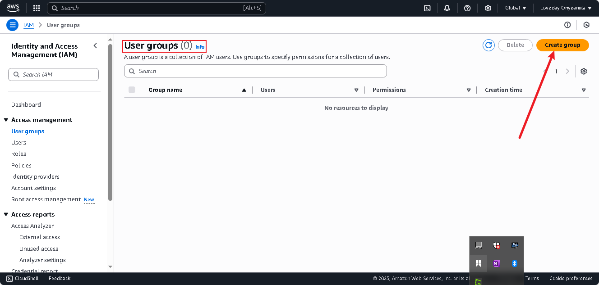

# Cloud Computing - Security and Identity Management (IAM)

This project is designed to guide through the intricacies of Amazon Web Services (AWS) focused Security and Identity Management (IAM).

## Identity and Access Management in AWS
IAM (Identity and Access Management) in AWS is a service that enables you to securely manage access to AWS resources. 
IAM lets you create **users**, **groups**, **roles**, and **policies** to define permissions, ensuring least privilege access and enhancing the overall security and manageability of the AWS Cloud Services.

## IAM User and Group in AWS

- **IAM User:** An individual identity with specific credentials (like username and password or access keys) used to interact with AWS services.

- **IAM Group:** A collection of IAM users. Groups let you assign permissions to multiple users at once.

Imagine a company with 3 developers.
- You create IAM Users: **Dev1**, **Dev2**, and **Dev3**.
- You create a Group called Developers and attach permissions (e.g., access to Amazon S3 and EC2).
- You add all 3 users to the Developers group.

Now, all users in the group inherit the permissions assigned to the group — making management and access control easier.

## Principle of Least Privilege in AWS
The principle of least privilege in AWS means giving users, roles, and services only the minimum permissions they need to perform their tasks.

### Considerations:
- **Restrict access:** Start with no permissions and add only what’s necessary.
- **Use roles and policies** to define fine-grained access.
- **Regularly review** and adjust permissions as tasks or roles change.

If a user only needs to read files from an S3 bucket, grant them s3:GetObject permission not full access to all S3 actions.

This approach reduces security risks and helps protect sensitive data and resources.

## Practical Implementations
### 1. Create Policy for the Development Team

### 2. Create Group for the Development Team

### 3. Creating IAM USer for John and Mary

### 4. Implement MFA

### 5. Validating and Testing

