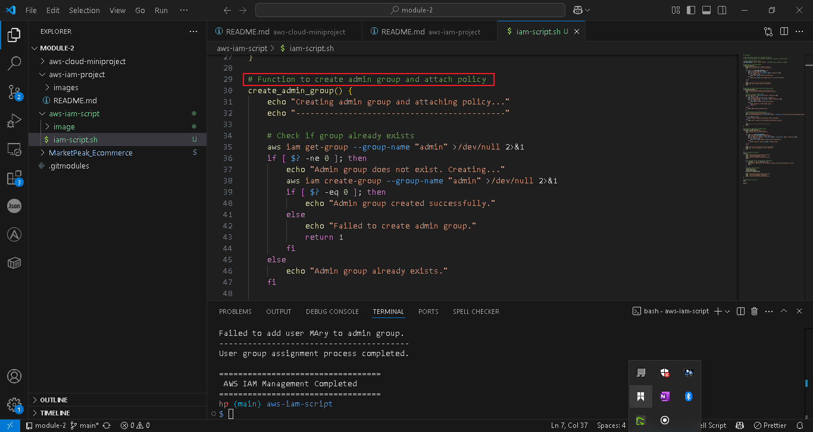
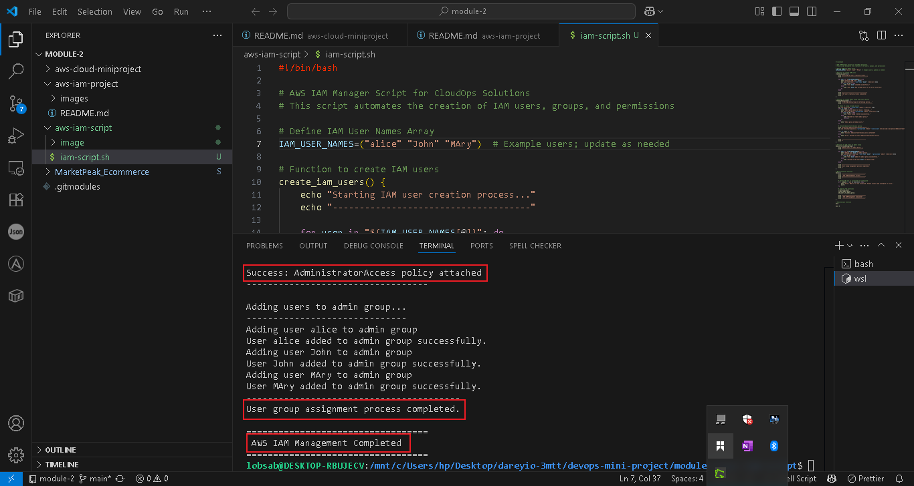

# Shell Script for AWS IAM Management

This project is designed to guide through the intricacies of Amazon Web Services (AWS) focused Security and Identity Management (IAM) using shell scripting.

The project involves enhancing a shell script to automate the management of AWS Identity and Access Management (IAM) resources. It focuses on streamlining the onboarding process for new DevOps employees at CloudOps Solutions by automating user creation, group management, and permission assignment.

## Practical Implementations
### 1. Writing the Bash Scripting File 

### 2. Running the Script

### 3. Scripts Runs Successfully

