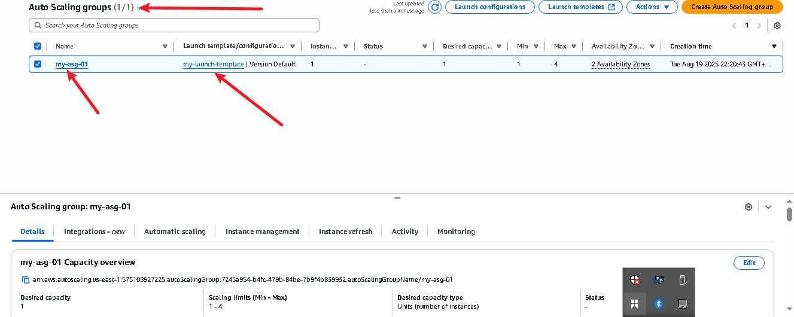

# AUTO SCALING WITH ALB USING LAINCH TEMPLATE

## Launch Template Details
- Name: `my-launch-template`
- AMI: Amazon Linux 2
- Instance Type: `t2.micro`
- User Data: Apache Web Server setup

## Auto Scaling Group
- Name: `my-asg`
- Desired Capacity: 1
- Min: 1, Max: 4
- Subnets: Subnet-A, Subnet-B (across AZs)

## Scaling Policy
- Policy Name: scaling-on-cpu
- Policy Type: Target Tracking
- Metric: Average CPU Utilization
- Target: 50%

## Load Balancer
- ALB Name: `my-alb`
- Listener: Port 80
- Target Group: Instance-based, HTTP

## Testing Auto Scaling
- Tool: `stress`
- Command: `stress -c 4`
- Outcome:
  - Increased CPU triggered scale-out
  - Decrease in CPU triggered scale-in

## Reflections
- Learned the benefits of decoupling compute from traffic with ALB.
- Auto Scaling provides resilience, cost savings, and performance optimization.
- Launch Templates offer reusability and consistent configurations.