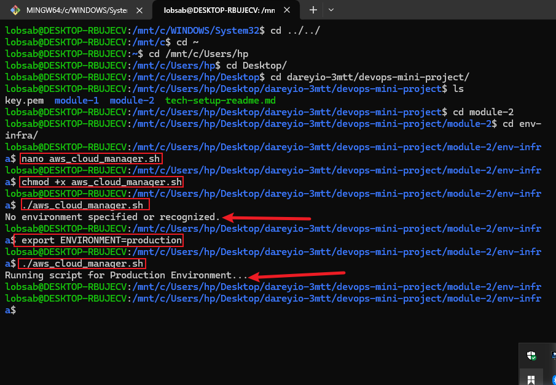
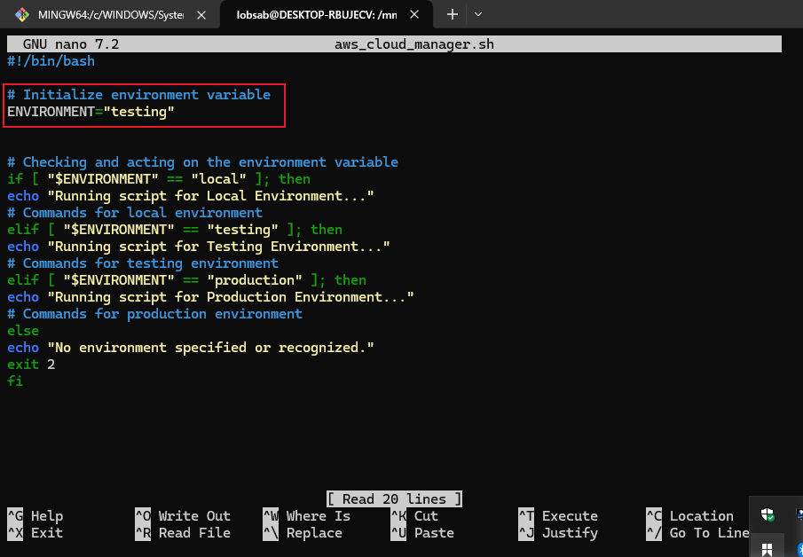
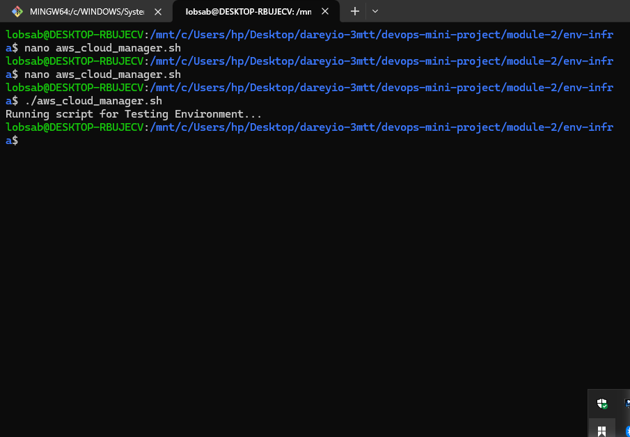
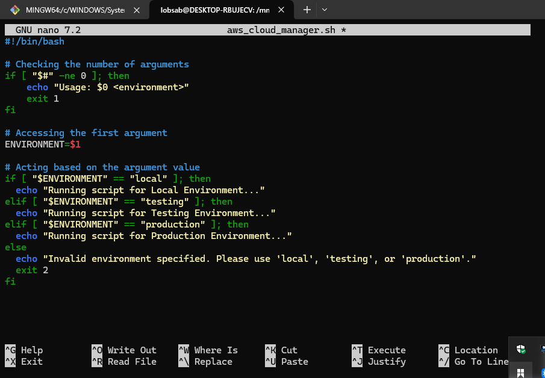
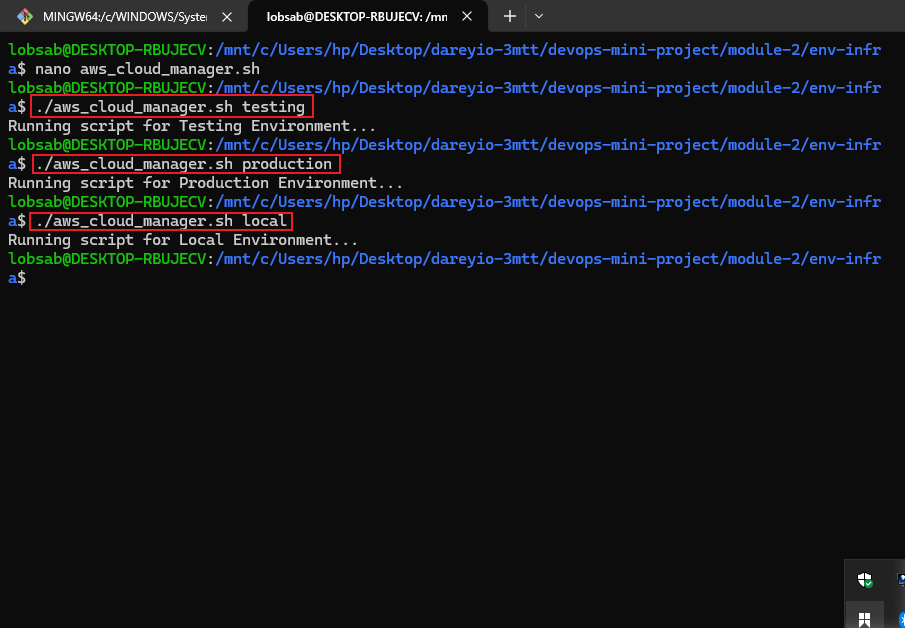

# Understanding Environment Variables & Infrastructure Environmen
In this mini project, I learned the key differences between **Infrastructure Environments** and **Environment Variables**. Infrastructure environments refer to the different setups (local, testing, production) used throughout the software development lifecycle, each hosted in separate systems like VirtualBox or AWS accounts. On the other hand, environment variables are dynamic key-value pairs used to manage configurations such as database credentials across these environments without hardcoding them into scripts. I learned how to create a shell script (`aws_cloud_manager.sh`) that dynamically responds to different environments using environment variables and positional parameters. Instead of hardcoding values, I used `$1` to accept environment input from the command line, making the script reusable and adaptable. I also implemented argument validation to ensure the script receives the correct input, enhancing reliability and user guidance. This project emphasized writing clean, flexible, and environment-aware scripts an essential skill in cloud and DevOps practices.

## Project Implementation

### 1. Running the script without environment variable

### 2. Setting the variables

### 3. Passing arguments

