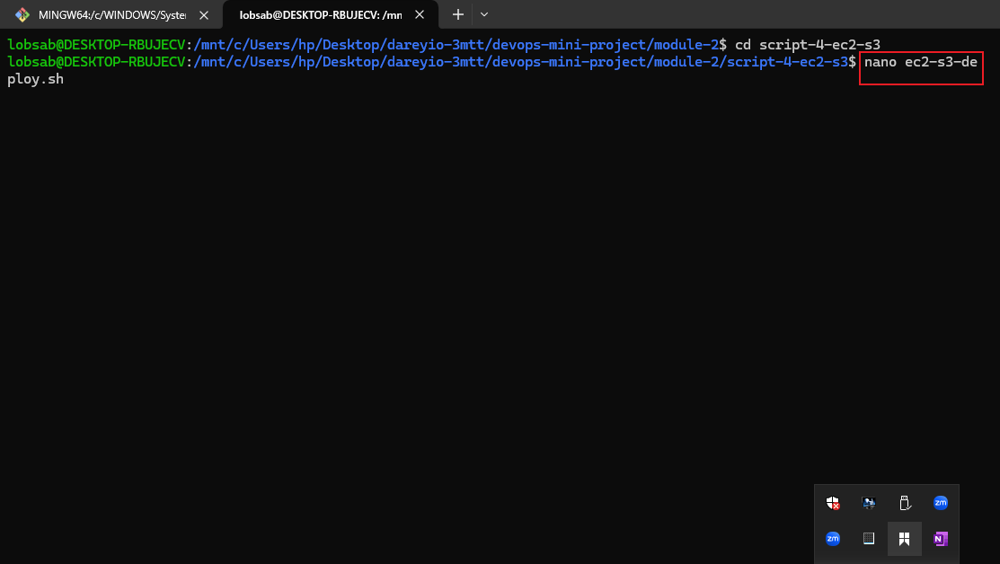
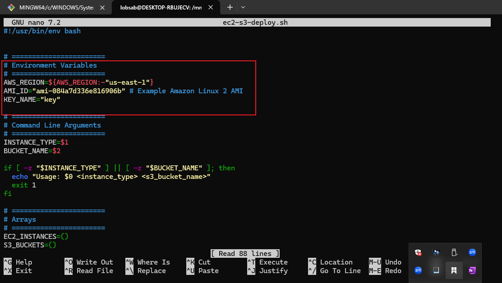
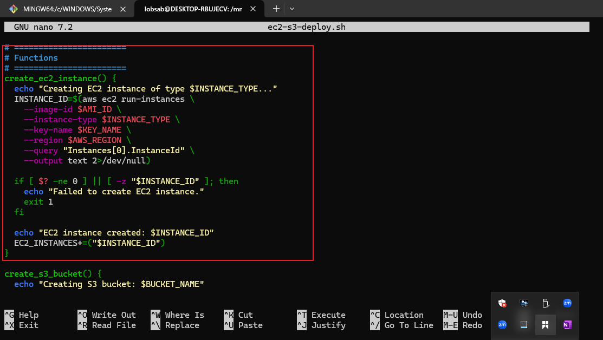
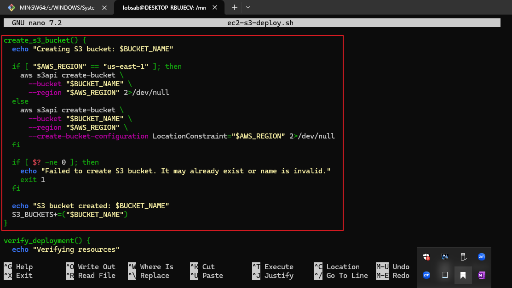
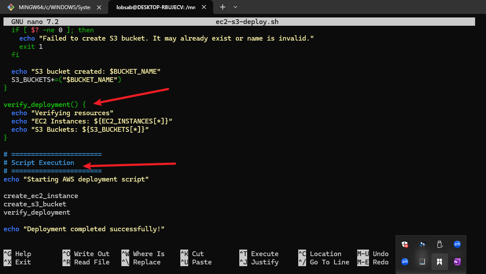
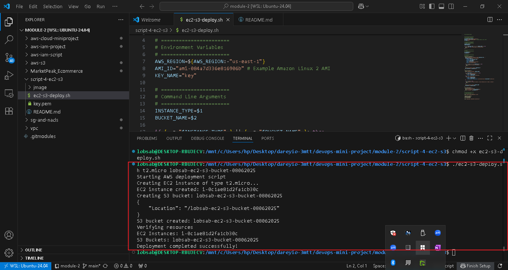
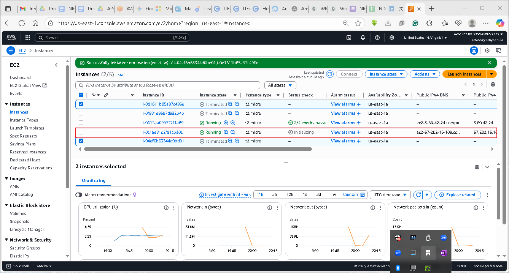
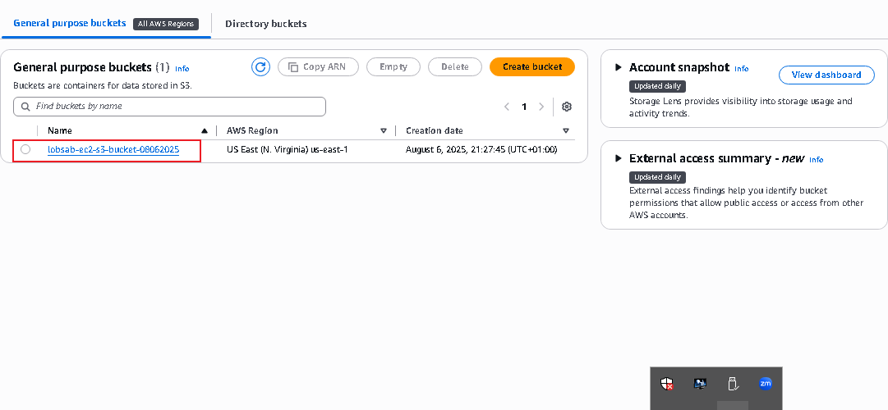

# AWS EC2 INSTANCE AND S3 BUCKET SCRIPT DEPLOYMENT

**DataWise Solutions** is a forward-thinking Data Science Consulting Company that specializes in deploying analytical and machine learning environments to support data-driven decision-making for its clients. Recognizing the need for agility and efficiency in setting up such environments, DataWise has decided to streamline its deployment process on AWS, focusing on simplicity and automation.

**Scenario:**

One of DataWise Solutions' clients, a burgeoning e-commerce startup, is looking to harness the power of data science to analyze customer behavior and enhance their shopping experience. The startup wishes to deploy their data science workspace on AWS, utilizing EC2 instances for computational tasks and S3 buckets for storing their vast datasets of customer interactions.

## Project Implementation
1. Create a working directory for this project
2. Create shell script file inside the project directory and write the script

3. Change the script file permisssions with this command *chmod +x ec2-s3-deploy.sh*
4. Now run the script with this command *./ec2-s3-deploy.sh*

5. Navigate to the AWS EC2 Instance console

6. Navigate to the AWS S3 Bucket console
