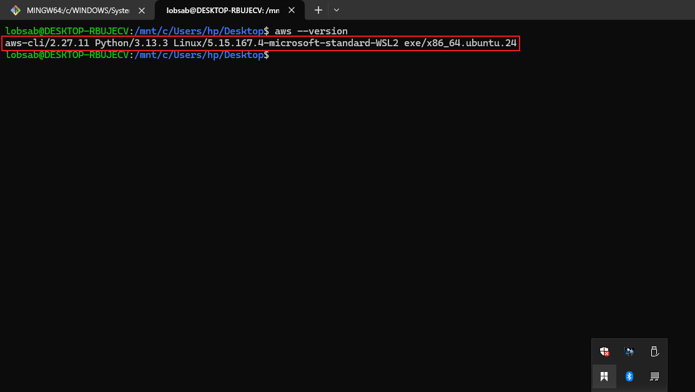
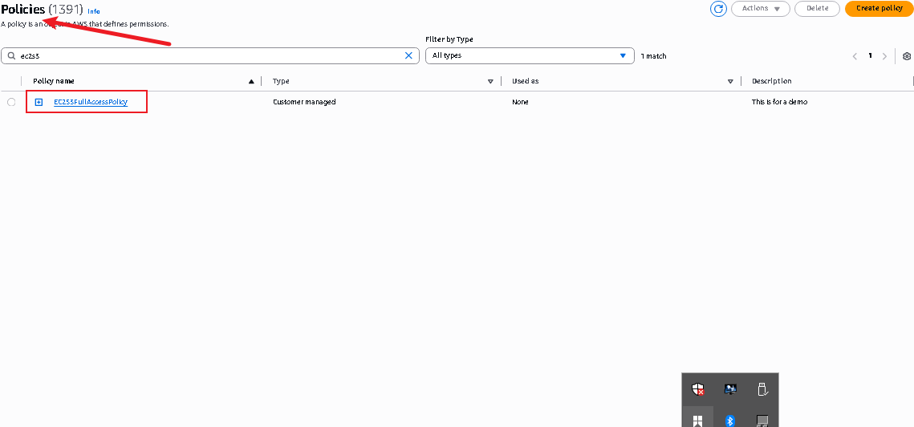
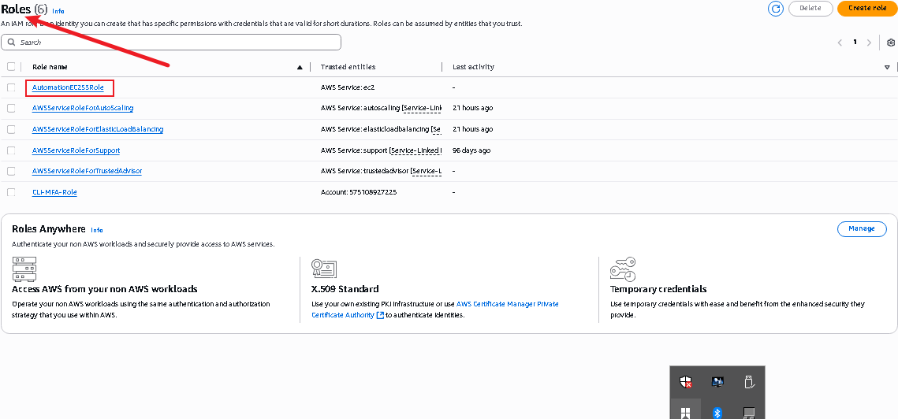
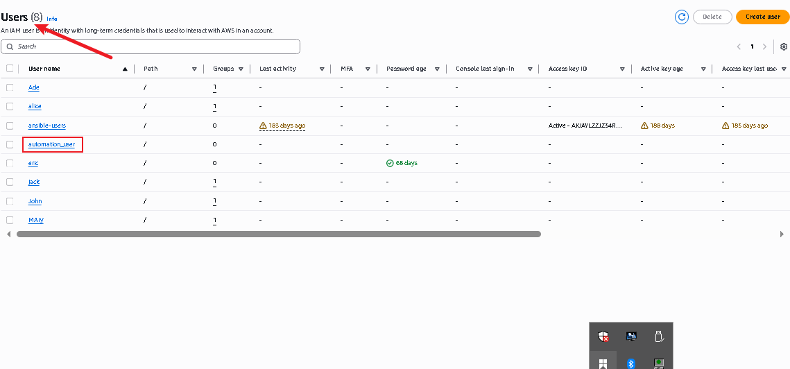

# AWS CLI Authentication & Automation Mini Project

## Project Overview

This mini project demonstrates how to securely set up and authenticate to the AWS API using the AWS Command Line Interface (CLI). You'll learn how to configure AWS Identity and Access Management (IAM) components and interact with AWS services (like EC2 and S3) directly from a terminal using shell scripts.

----

## 1. Understanding AWS CLI and APIs

### What is AWS CLI?
The AWS CLI (Command Line Interface) is a tool that enables you to interact with AWS services using commands in your terminal or command prompt. This is particularly useful for automating cloud infrastructure tasks such as launching EC2 instances or managing S3 buckets.

### What is an API?
An API (Application Programming Interface) allows software components to communicate. AWS APIs let you create and manage cloud resources programmatically using CLI commands or code, without manually interacting with the AWS Management Console.

### Why Use CLI and API?
- Automates cloud workflows
- Ensures repeatable deployments
- Reduces manual error
- Enables scripting and infrastructure as code

---

## 2. IAM Configuration Steps

### Create IAM Policy

Create a policy that allows full access to EC2 and S3:

### Create IAM Role

### Create IAM User

## Testing the Configurations

