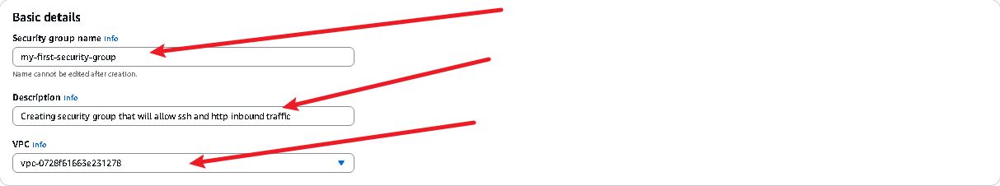
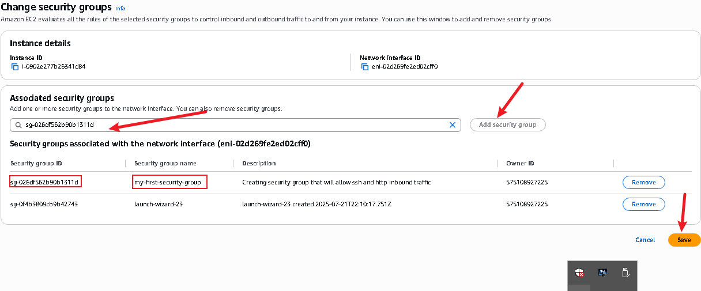
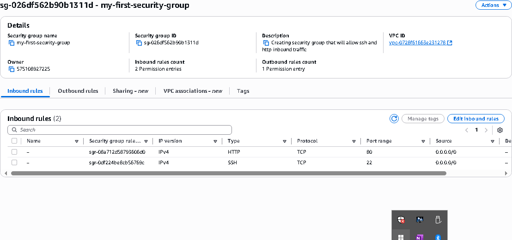
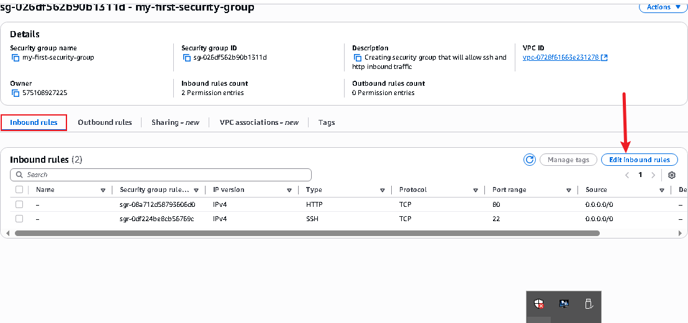

# Security Groups and NACLs Project

The two building firewalls capabilities both apply to different spot in AWS.

## Security Group
The security group is a firewall that consist of inbound and outbound rules that controls incoming and outgoing traffic from an AWS resource (EC2 instance or RDB database)

## Network Address Control Lists (NACLs):
NACLs is a virtual firewall at the subnet level controlling traffic entering and exiting the subnet within a **VPC (Virtual Private Cloud)**

**Stateless:** Unlike security groups, NACLs are stateless, meaning they do not  automatically allow return traffic. You must explicitly configure rules for both inbound and outbound traffic.

**Allow/Deny:** NACLs rules can either allow or deny traffic based on the specified criteria.

**Default Security Group:** Every VPC comes with a default security group that allows all outbound traffic and denies all inbound traffic by default.

**Default NACL:** Every subnet within a VPC is associated with a default NACL that allows all inbound and outbound traffic by default.

### Difference Between Security Group and NACL
Security group in AWS act like virtual firewall that control traffic at the instance level. They define rules for inbound and outbound traffic based on protocols, ports and IP addresses. Essentially, they protect individual instances by filtering traffic allowing only authorized communication.

On the other hand, NACL functions at the subnet level, overseeing traffic entering and leaving the subnets. They operate as a barrier for entire subnet, filtering traffic based on IP addresses and protocol numbers. 

**Note:** In security group there is no explicitly "deny" option as seen in NACL's any rule configured within a security group implies permission, meaning that iif a rule is established it is automatically allowed.

## Practical Implementations
1. **SECURITY GROUP**
### EC2 Instance Created

Security group of the instance

For the outbound rule

Now, let's test accessibility to the website using the public ip address

The web page is inaccessible

Navigate to the "Security Groups" section on the left pane and create sg.

Now navigate to the instance section of left pane.
- Select the instance.
- Click on “Actions.”
- Choose “security.

Copy the public ip address as highlighted above and run on the browser for it to load the website

This setup allows the HTTP and SSH protocols to access the instance

The outbound rule permits all traffic to exit the instance.

Through the above rules, we're able to access the website.

Let's see how removing the outbound rule affects the instance's connectivity.

Now, the outbound rule have been removed and the website is still accessible. 

According to the logic we discussed, when a user accesses the instance, the inbound rule permits HTTP protocol traffic to enter. However, when the instance sends data to the user's browser to display the website, the outbound rule should prevent it. Yet, we're still able to view the website. Why might that be?

Security groups are stateful, which means they automatically allow return traffic initiated by the instances to which they are attached. So, even though we removed the outbound rule, the security group allows the return traffic necessary for displaying the website, hence we can still access it.

Now to delete the inbound rule like we did on the outbound rule.

As the inbound and outbound rules have been deleted, the website becomes inaccessible because, the instance receives no traffic from the internet.

We will add the HTTP traffic to the outbound rule

Now, let’s see if the website can be accessed.

2. **NETWORK ACCESS CONTROL LIST (NACLs)**
Navigate to the VPC dashboard from the search bar

Click on "Network ACLs"

Navigate to the "Inbound rule"

Navigate to the "Outbound rule"

Click to edit "Inbound rule"

NACL is not associated with any of the subnets in the VPC.

Now, let’s associate NACLs to the subnet.

Try accessing the website. You will notice that you are unable to see the website.

Let's look at the inbound rule and the outbound rule

Click to edit the outbound rule

Revisit the website and now see that you can access it.

Let’s remove the inbound and outbound rules so by default it be denied all traffic.

