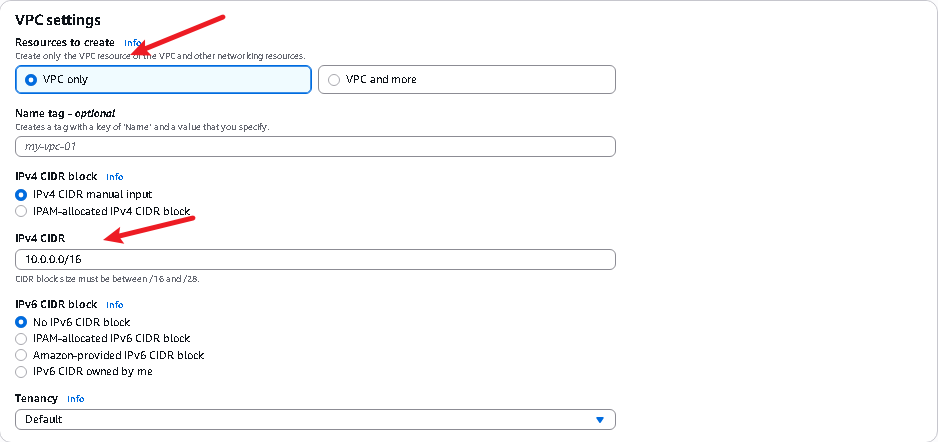

# AWS VPC - VIRTUAL PRIVATE CLOUD
In this session, we'll explore the core concepts of Amazon Web Services (AWS), focusing specifically on Virtual Private Clouds (VPCs). Our objective is to understand the fundamental components of VPC infrastructure, including subnets, gateways, and routing tables. Through practical demonstrations and interactive exercises, we'll navigate the AWS management console to deploy and manage these critical components effectively.

## Definition of Concepts
1. **IP Address:**
It's a unique identifier for devices on a network, like the Internet. There are two main types of IP Address:
- **Private IP Address:** They're IP addresses assigned by a router or DHCP servers within a network.
- **Public IP Address:** A public IP address is globally unique and is assigned by the Internet Service Provider (ISP) to a device connected to the internet.

2. **Gateway:**
Gateways are like doorways between different networks. They help data travel between your local network and other networks, like the internet.

3. **Route Table:**
A route table is like a map that helps data find its way around a network. Just like a map shows you the best routes to get from one place to another, a route table tells devices on a network how to send data packets to their destinations.

*In summary, gateways and route tables work together to facilitate the routing of network traffic between different networks. Gateways serve as the entry and exit points between networks, while route tables provide the necessary routing information to determine how data packets should be forwarded to their destinations.*

## PRACTICAL IMPLEMENTATION

**STEPS...**

1. **Setting Up a Virtual Private Cloud (VPC)**

2. **Configuring Subnets within the VPC**

3. **Creating Internet Gateway and attaching it to VPC**

4. **Enabling Internet Connectivity with the Internet Gateway by setting up Routing tables**

5. **Enabling Outbound Internet Access through NAT Gateway**

6. **Establishing VPC Peering Connections**

